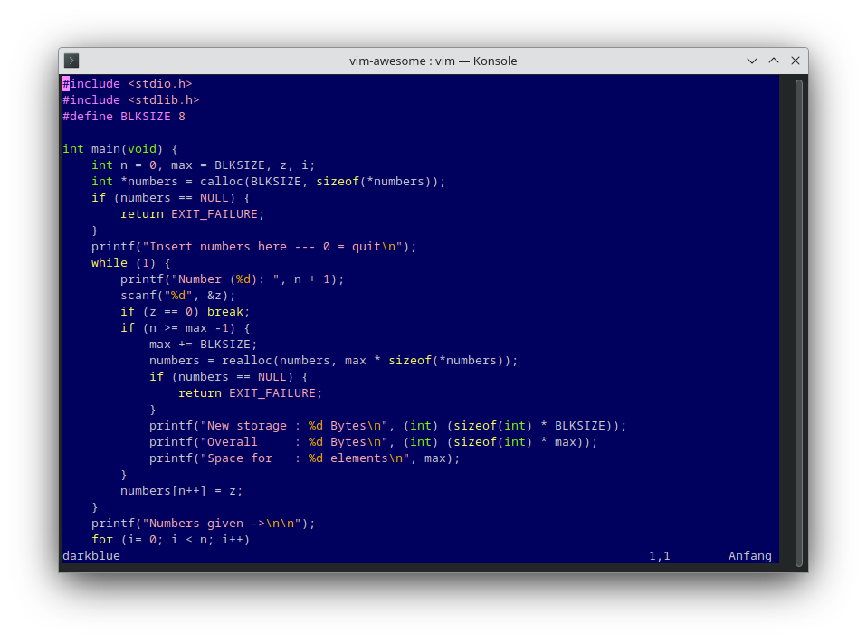
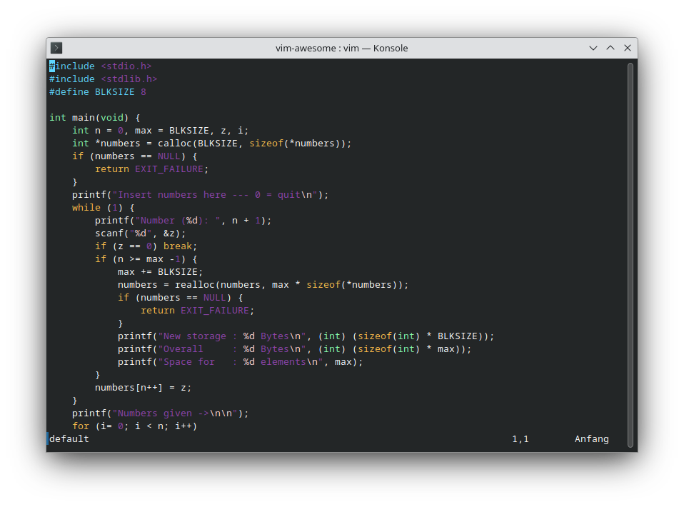
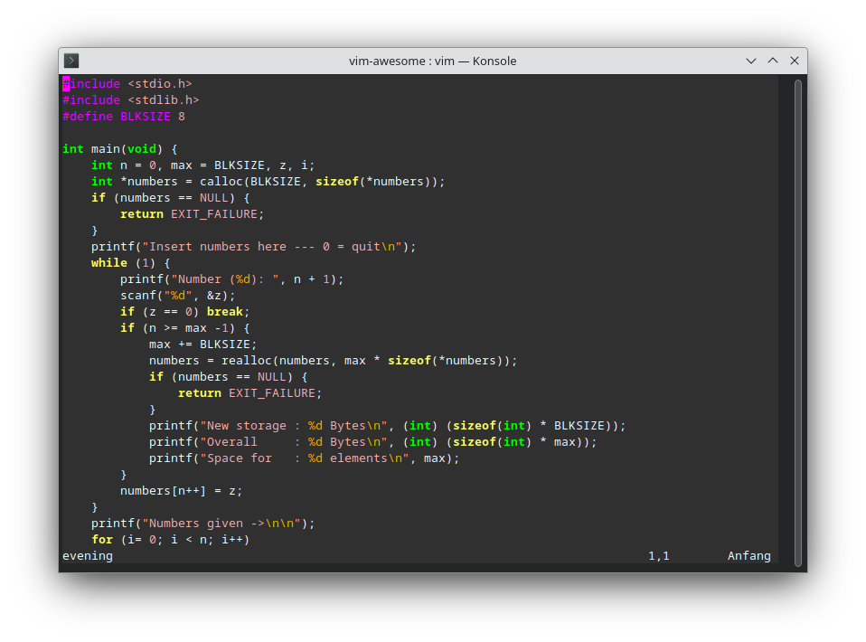
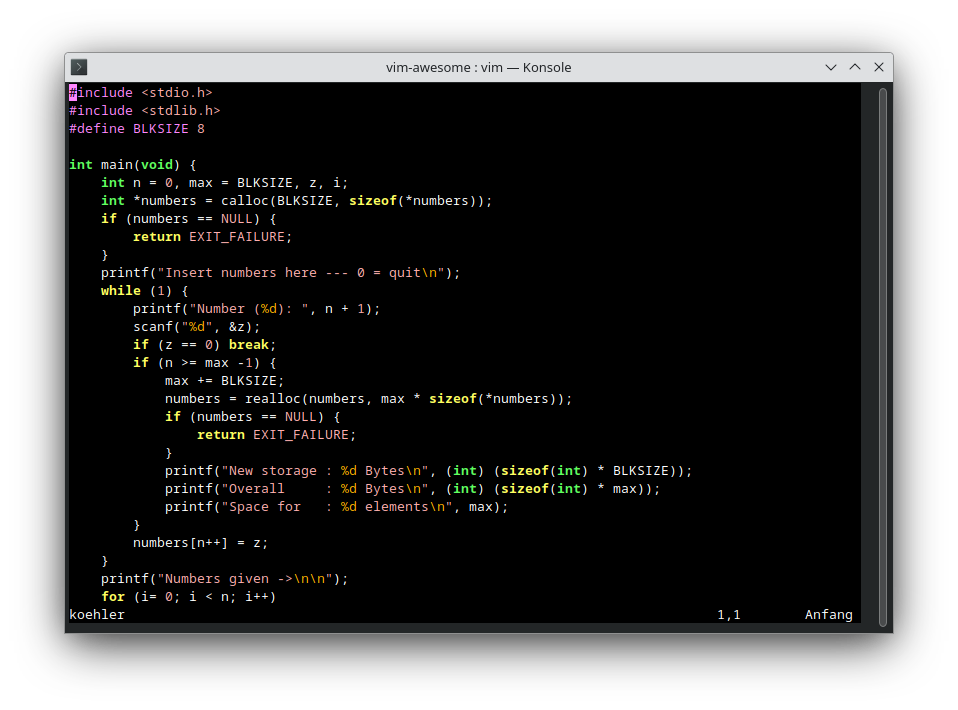
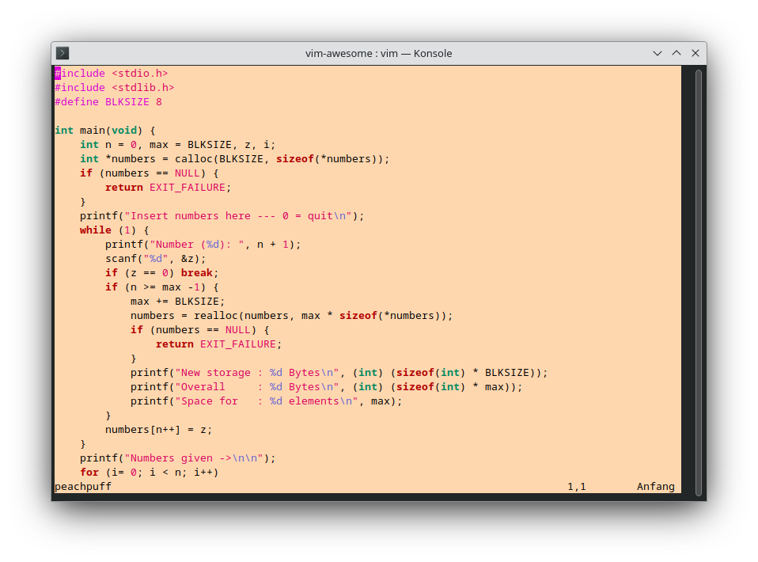
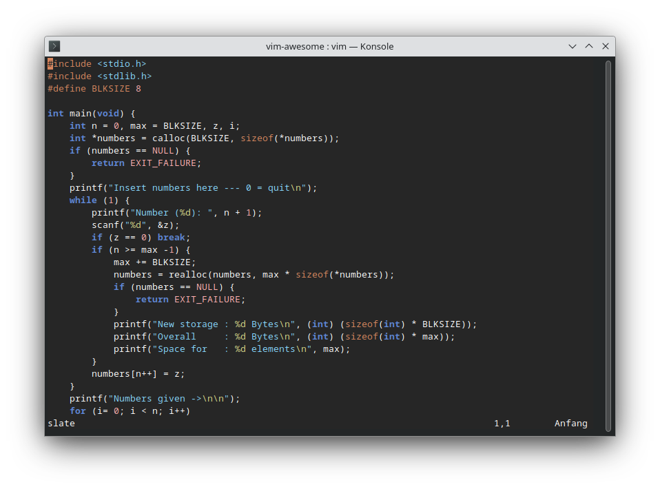

# A Vim colorschemes gallery

[Vim](https://github.com/vim/) has [colorschemes](https://github.com/vim/colorschemes).

`:` `colorschemes` <key>[space]</key> <key>[tab]</key>

## blue
Colorscheme with a blue background. 
Author: Steven Vertigan 

## darkblue
For those who prefer dark background. 
Author: Bohdan Vlasyuk 

## default
This is the default color scheme. 
Author: Bram Moolenaar 

## delek
Light background colorscheme. 
Author: David Schweikert 

## desert
Light background colorscheme. 
Author: Hans Fugal 

## elflord
Author: Ron Aaron 

## evening
This color scheme uses a dark grey background. 
Author: Bram Moolenaar 

## habamax
Hubba hubba hubba. 
Author: Maxim Kim 

## industry
"industry" stands for 'industrial' color scheme. 
Author: Shian Lee 

## koehler
Author: Ron Aaron 

## lunaperche
Perchè il sole a Milano? Portofino? Dimmi la luna perchè? White(perchè il sole)/Black(la luna perchè?) background colorscheme. 
Author: Maxim Kim 

## morning
Colorscheme with light grey background. 
Author: Bram Moolenaar 

## murphy
Green foreground black background. 
Author: Ron Aaron 

## pablo
Author: Ron Aaron 

## peachpuff
This color scheme uses a peachpuff background (what you've expected when it's called peachpuff?). 
Author: David Ne&#269;as (Yeti) 

## quiet
A mostly monochrome colorscheme, with a few niceties. 
Author: Maxence Weynans 

## ron
Author: Ron Aaron 

## shine
Light colorscheme inspired by normal text editors. 
Author: Yasuhiro Matsumoto 

## slate
Remake of slate. 
Maintainer: Ralph Amissah 

## torte
Remake of torte (grey on black). 
Maintainer: Thorsten Maerz 

## zellner
Light background colorscheme. 
Author: Ron Aaron 

