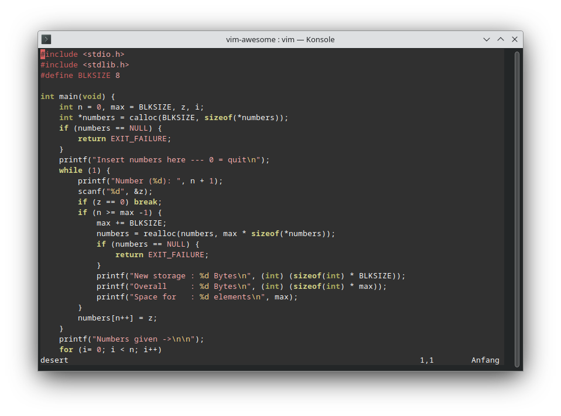
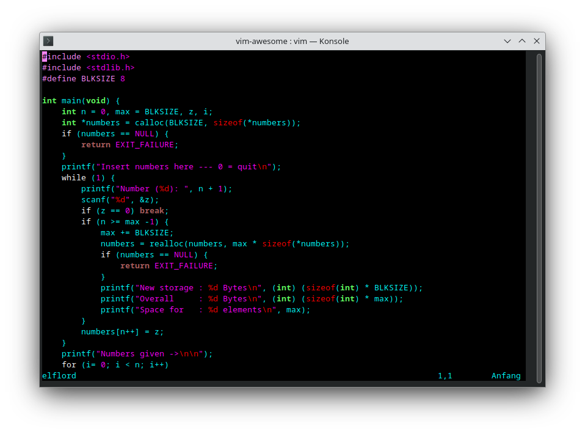
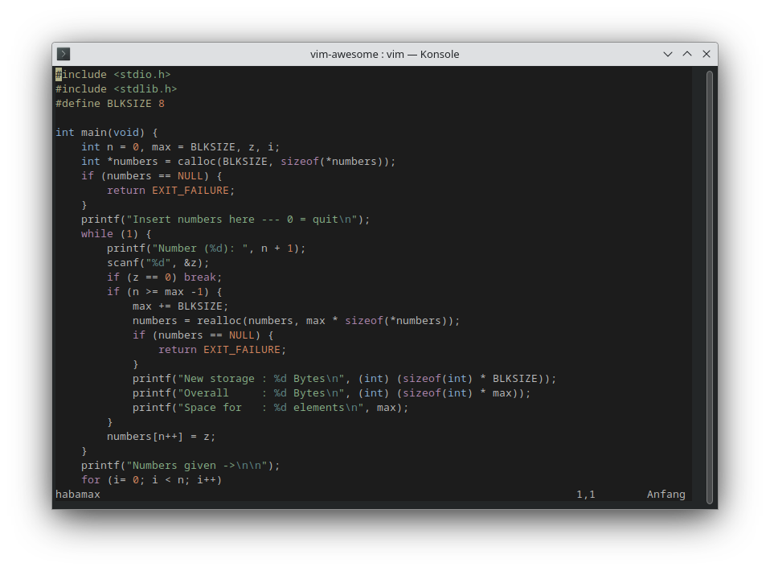

# Vim Colorschemes Gallery
A [Vim](https://github.com/vim/) standard[^1] colorschemes list. Saves you testing one by one.

[^1]: I don't know if these are in every distribution standard colorschemes, but in [Fedora](https://getfedora.org). If you know more: Please drop a (friendly) [comment](https://github.com/9juhnke/Vim-Colorschemes-Gallery/issues).

### 256_noir
A 256-color colorscheme, by Andreas van Cranenburgh.
 https://github.com/andreasvc/vim-256noir

### OceanicNext, OceanicNextLight
Inspired by [Oceanic Next](https://github.com/voronianski/oceanic-next-color-scheme), by Mike Hartington.
 https://github.com/mhartington/oceanic-next

### PaperColor (default dark, default light)
Inspired by [Material Design](https://material.io/), by Nikyle Nguyen.
 https://github.com/NLKNguyen/papercolor-theme

### abstract
Based on [Abstract](https://www.abstractapp.com), by Jonathan Simcoe.
 https://github.com/jdsimcoe/abstract.vim

### afterglow
Adaptation of [Afterglow](https://github.com/YabataDesign/afterglow-theme), by Danilo Augusto.
 https://github.com/danilo-augusto/vim-afterglow

### alduin
A Vim colorscheme, by Alessandro Yorba.
 https://github.com/AlessandroYorba/Alduin

### anderson
Based on colors from Wes Anderson films, by Thomas Löhr.
 https://github.com/tlhr/anderson.vim

### angr
A Vim colorscheme, by Zac Anger.
 https://github.com/zacanger/angr.vim

### apprentice
Based on [Sorcerer](https://www.vim.org/scripts/script.php?script_id=3299), by Jeet Sukumaran.
 https://github.com/romainl/Apprentice

### archery
Inspired by Arch Linux color palette, by Baptiste Vannesson.
 https://github.com/Badacadabra/vim-archery

### atom
Designed to be readable in light and dark environments, by Greg Sexton.
 https://github.com/gregsexton/Atom

### ayu
A Vim colorscheme, looking for maintainer.
 https://github.com/ayu-theme/ayu-vim

### blue
Colorscheme with a blue background, Original by Steven Vertigan.
 https://github.com/vim/colorschemes

### carbonized-dark, carbonized-light
Adapted from [base16-vim](https://github.com/chriskempson/base16-vim) by Chris Kempson.
 -

### challenger_deep
A Vim colorscheme.
 https://github.com/challenger-deep-theme/vim

### darkblue
For those who prefer dark background, Original by Bohdan Vlasyuk.
 https://github.com/vim/colorschemes

### deep-space
Based of [Hybrid](https://github.com/w0ng/vim-hybrid), by Brandon Siders.
 https://github.com/tyrannicaltoucan/vim-deep-space

### default
This is the default color scheme, by Bram Moolenaar.
 `/user/share/vim/`

### delek
A Vim colorscheme, Original by David Schweikert.
 https://github.com/vim/colorschemes

### desert
A Vim colorscheme, Original by Hans Fugal.
 https://github.com/vim/colorschemes

### deus
Caused by all of the bad Solarized/Gruvbox clones, by Avery Wagar.
  https://github.com/ajmwagar/vim-deus

### dogrun
A Vim colorscheme, by Tsuyoshi Wada. 
 https://github.com/wadackel/vim-dogrun

### elflord
A Vim colorscheme, Original by Ron Aaron.
 https://github.com/vim/colorschemes

### evening
A Vim colorscheme, Original by Bram Moolenaar.
 https://github.com/vim/colorschemes

### flattened_dark, flattened_light
Solarized, by Romain Lafourcade.
 https://github.com/romainl/flattened

### focuspoint
Between Molokai and Zenburn, by Chase Colman.
 https://github.com/chase/focuspoint-vim

### fogbell, fogbell_light, fogbell_lite
A Vim colorscheme, by Jared Gorski.
 https://github.com/jaredgorski/fogbell.vim

### github
Based on github's syntax highlighting, Original by Anthony Carapetis.
 https://github.com/endel/vim-github-colorscheme

### gotham, gotham256
A Vim colorscheme, by Andrea Leopardi.
 https://github.com/whatyouhide/vim-gotham

### gruvbox (default dark, default light)
Inspired by [badwolf](https://github.com/sjl/badwolf), [jellybeans](https://github.com/nanotech/jellybeans.vim) and [solarized](https://ethanschoonover.com/solarized/), by Pavel Pertsev.
 https://github.com/morhetz/gruvbox

### habamax
Hubba hubba hubba, by Maxim Kim.
 https://github.com/vim/colorschemes

### happy_hacking
Based on [Autumn](https://github.com/yorickpeterse/autumn.vim), by Yorick Peterse.
 https://github.com/yorickpeterse/happy_hacking.vim

### hybrid (default light, default dark)
Taken from [Tomorrow-Night](https://github.com/chriskempson/vim-tomorrow-theme) and [Codecademy's online editor](htps://www.codecademy.com/learn), by Andrew Wong.
 https://github.com/w0ng/vim-hybrid

### hybrid_material, hybrid_reverse (default light, default dark)
Almost similar to [hybrid](https://github.com/w0ng/vim-hybrid), some colors like [tomorrow-night](https://github.com/chriskempson/base16-vim), by Kristijan Husak.
 https://github.com/kristijanhusak/vim-hybrid-material

### iceberg (default light, default dark)
A Vim colorscheme, by Hiroki Kokubun.
 https://github.com/cocopon/iceberg.vim

### industry
A Vim colorscheme, Original by Shian Lee.
 https://github.com/vim/colorschemes

### jellybeans
Inspired by [ir_black](https://web.archive.org/web/20140211124943/http://toddwerth.com/2008/01/25/a-black-os-x-leopard-terminal-theme-that-is-actually-readable/) and [twiligh](http://www.vim.org/scripts/script.php?script_id=1677)t.
 https://github.com/nanotech/jellybeans.vim

### koehler
A Vim colorscheme, by Ron Aaron.
 https://www.github.com/vim/colorschemes

### lightning
Based on [Apprentice](https://github.com/romainl/Apprentice/), by Stefan Wimmer.
 https://github.com/wimstefan/Lightning

*... to be continued ...*
